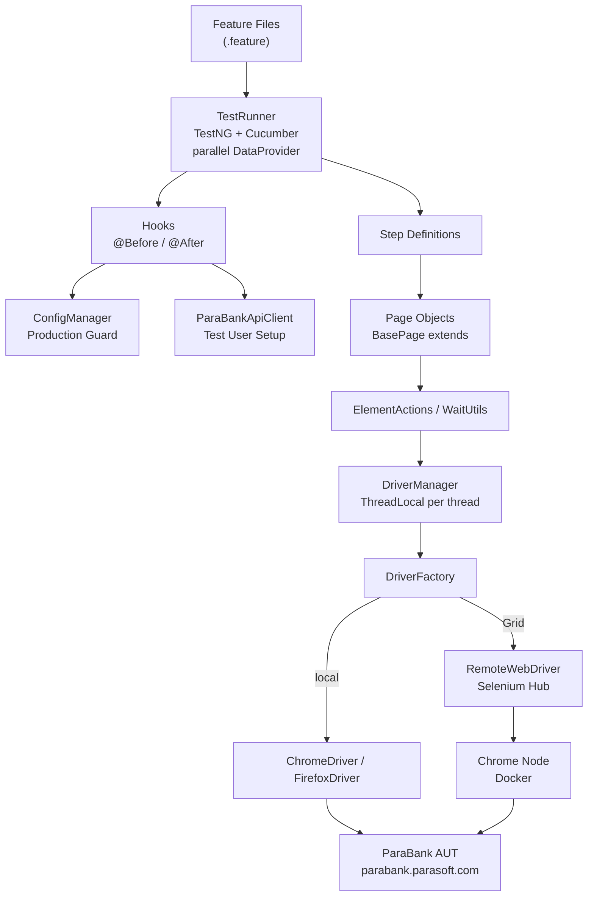
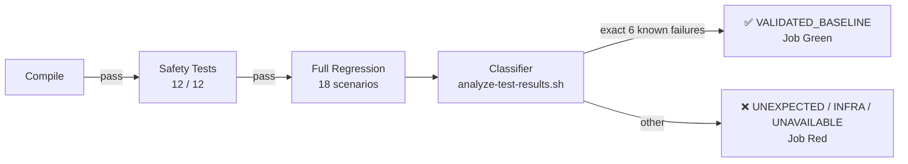

# ParaBank BDD Automation Framework

[](https://github.com/SharifulIslamSabuj/BDDFramework-ParabankAutomation/actions/workflows/automation-test.yml)
[](https://openjdk.org/projects/jdk/17/)
[](https://www.selenium.dev/)
[](https://cucumber.io/)
[](https://testng.org/)
[](https://gradle.org/)
[](https://docs.docker.com/compose/)

Portfolio-grade Java BDD automation framework for the [ParaBank](https://parabank.parasoft.com/parabank/) public banking demo, demonstrating maintainable UI automation, API-assisted test setup, production-write protection, Selenium Grid execution, CI result classification, and evidence-driven engineering practices.

**Release documentation: v1.1.0** — [CHANGELOG](CHANGELOG.md) · [Release Notes](RELEASE_NOTES_v1.1.0.md)

---

## What This Project Demonstrates

| Capability | Implementation |
|---|---|
| **BDD / Gherkin** | Cucumber feature files and step definitions |
| **Page Object Model** | `BasePage` with typed `createPage()` factory; private locators; fluent API |
| **Parallel execution** | `ThreadLocal<WebDriver>`, TestNG `@DataProvider(parallel=true)`, SLF4J MDC |
| **Explicit waits** | `WaitUtils` / `WebDriverWait` — zero `Thread.sleep()` in the framework |
| **API-assisted setup** | `ParaBankApiClient` with Java 17 `HttpClient`; browser fallback; idempotent |
| **Data-driven testing** | Excel `@DataProvider` (Apache POI) and `LoremIpsum` generated test data |
| **Selenium Grid** | Docker health-check cascade; `RemoteWebDriver`; noVNC session inspection |
| **Docker support** | Multi-stage `Dockerfile`, `docker-compose.yml`, `docker-compose.grid.yml` |
| **CI pipeline** | GitHub Actions — compile gate → safety gate → regression → result classification |
| **CI classification** | Python 3 classifier — JUnit XML for execution counts, Cucumber JSON scenario IDs for failed-scenario identity; green badge only for `VALIDATED_BASELINE` |
| **Production safety** | Write guard blocks automatic test-data creation against `prod`/`production` |
| **Configuration** | 4-level priority chain (JVM property → env var → properties → default) |
| **Credential security** | No secrets in source; GitHub Secrets; passwords never logged |
| **Structured reporting** | ExtentReports, Allure, Cucumber HTML, TestNG, MDC logs, failure screenshots |
| **Risk governance** | Evidence-based risk register; known AUT limitations documented and retained |

---

## Validation Status

| Metric | Result |
|---|---|
| Production-safety tests | 12 / 12 passed |
| Cucumber executions | 18 |
| Passed scenarios | 12 |
| Known AUT failures | 6 |
| Unexpected failures | 0 |
| CI classification | `VALIDATED_BASELINE` |

The 6 failures are **documented AUT limitations**, not framework defects. They are intentionally preserved so the test suite accurately reflects the current behaviour of the public ParaBank demo server. The CI pipeline is **green** when exactly these 6 failures are observed. Any new or different failure turns CI red.

→ [docs/KNOWN_AUT_LIMITATIONS.md](docs/quality/KNOWN_AUT_LIMITATIONS.md) · [docs/CI_CD_GUIDE.md](docs/guides/CI_CD_GUIDE.md)

---

## Quick Start

**Prerequisites:** Java 17, Git, Google Chrome (latest stable). ChromeDriver is managed automatically by WebDriverManager — no manual download.

```bash
# 1. Clone
git clone https://github.com/SharifulIslamSabuj/BDDFramework-ParabankAutomation.git
cd BDDFramework-ParabankAutomation

# 2. Compile
./gradlew clean compileTestJava

# 3. Safety tests (12 focused tests — no browser, ~1s)
./gradlew test --tests "*ProductionSafetyGuardTest"

# 4. Full regression (18 scenarios — ~3 minutes)
./gradlew clean test
```

**Expected:** `30 tests completed, 6 failed` — the 6 failures are the accepted AUT baseline.

```bash
# Smoke test only (1 scenario)
./gradlew clean test -Dcucumber.filter.tags="@smoke"

# Firefox
./gradlew clean test -Dbrowser=firefox

# Staging environment (requires TEST_USERNAME / TEST_PASSWORD env vars)
./gradlew clean test -Denv=staging
```

For Grid, Docker, and full configuration options, see the sections below.

---

## Architecture



### Component Responsibilities

| Component | Responsibility |
|---|---|
| `TestRunner` | Cucumber + TestNG integration; parallel DataProvider; runtime tag selection |
| `Hooks` | `@Before`: MDC setup, driver init, one-time test-data provisioning; `@After`: screenshot on fail, driver quit |
| `Step Definitions` | Map Gherkin steps to Java; delegate all UI work to page objects |
| `BasePage` | Shared driver reference; typed `createPage()` factory; delegates to ElementActions and WaitUtils |
| `Page Objects` | Private locators; page-specific actions; fluent API for step definitions |
| `ElementActions` / `WaitUtils` | Single-responsibility Selenium wrappers; no `Thread.sleep()` |
| `DriverFactory` | Creates local browser or `RemoteWebDriver` based on `seleniumGridEnabled` |
| `DriverManager` | `ThreadLocal<WebDriver>` — one isolated instance per parallel test thread |
| `ConfigManager` | Singleton; 4-level credential chain; production-write guard |
| `ParaBankApiClient` | HTTP form POST for test user setup — faster than browser registration |
| `ScreenshotUtils` | PNG capture on failure; embeds in ExtentReport and Cucumber HTML |

→ [docs/ARCHITECTURE.md](docs/architecture/ARCHITECTURE.md) — Mermaid diagrams, design decisions, and trade-offs

---

## Technology Stack

| Area | Tool | Version |
|---|---|---|
| Language | Java | 17 |
| Build | Gradle | 9.0.0 |
| UI automation | Selenium WebDriver | 4.40.0 |
| BDD | Cucumber | 7.34.2 |
| Test runner | TestNG | 7.12.0 |
| Browser driver | WebDriverManager | 5.7.0 |
| API client | Java `HttpClient` | (JDK built-in) |
| Reporting | ExtentReports | 5.1.2 |
| Reporting | Allure | 2.32.0 |
| Test data | Apache POI (Excel) | 5.2.3 |
| Test data | LoremIpsum | 2.2 |
| Logging | SLF4J + Logback | 2.0.13 / 1.5.6 |
| Grid | Selenium Hub + Chrome Node | 4.25.0 |
| Containerisation | Docker Compose | v2 |
| CI | GitHub Actions | — |

---

## Execution Options

### Local — tag filtering

```bash
# Default: @smoke or @negative or @regression (18 executions)
./gradlew clean test

# Smoke only (fast sanity check)
./gradlew clean test -Dcucumber.filter.tags="@smoke"

# Security probes only
./gradlew clean test -Dcucumber.filter.tags="@negative and @security"

# Increase parallelism
./gradlew clean test -DmaxParallelForks=4 -Ddataproviderthreadcount=4
```

Active tags:

| Tag | Purpose |
|---|---|
| `@smoke` | Single critical happy-path — fast sanity check |
| `@regression` | Full feature regression suite (feature-level) |
| `@positive` | Expected-success scenarios |
| `@negative` | Invalid-input, boundary, and rejection scenarios |
| `@validation` | Input-validation and business-rule scenarios |
| `@security` | Injection and scripting-probe scenarios |

### Docker

No Java or Chrome installation required on the host:

```bash
# Build and run (default: Chrome, qa environment)
docker compose up --build

# Override environment variables
ENV=staging BROWSER=chrome docker compose up

# Clean up
docker compose down
```

Reports, screenshots, and logs are volume-mounted to the host at `build/reports/`, `build/screenshots/`, `build/logs/`, and `allure-results/`.

> `--shm-size=2g` is required for Chrome. Docker Compose sets this automatically.

### Selenium Grid

Selenium Grid 4 routes WebDriver sessions through a Hub to a Chrome Node. A health-check cascade ensures both Hub and Node are ready before tests start:

```bash
# 1. Start Grid (Hub + Chrome Node)
docker compose -f docker-compose.grid.yml up -d selenium-hub chrome-node

# 2. Wait for Grid readiness (PowerShell)
.\scripts\wait-for-grid.ps1

# 3. Run tests via RemoteWebDriver
./gradlew clean test -DseleniumGridEnabled=true -DgridUrl=http://localhost:4444/wd/hub

# 4. Clean up
docker compose -f docker-compose.grid.yml down -v --remove-orphans
```

**Grid Console:** `http://localhost:4444/ui`  
**Live session (noVNC):** `http://localhost:7900` (password: `secret`)

→ [docs/SELENIUM_GRID_GUIDE.md](docs/guides/SELENIUM_GRID_GUIDE.md) — full Grid reference

---

## CI/CD Pipeline



| Stage | Command | Behaviour |
|---|---|---|
| Compile | `./gradlew compileTestJava` | Fail fast — no tests run on error |
| Safety tests | `./gradlew test --tests "*ProductionSafetyGuardTest"` | 12 tests; no browser; fail fast |
| Full regression | `xvfb-run ./gradlew clean test` | 18 Cucumber scenarios; exit code captured |
| Classify + summary | `scripts/analyze-test-results.sh` | Final gate — determines job outcome |

| Classification | CI outcome |
|---|---|
| `VALIDATED_BASELINE` | **Green** — exactly the 6 known AUT failures |
| `UNEXPECTED_REGRESSION` | **Red** — different or additional failures |
| `INFRASTRUCTURE_FAILURE` | **Red** — Cucumber suite did not execute |
| `RESULTS_UNAVAILABLE` | **Red** — no JUnit XML found, or the Cucumber JSON report is missing/malformed/inconsistent with the XML counts |

→ [docs/CI_CD_GUIDE.md](docs/guides/CI_CD_GUIDE.md) — full CI reference

---

## Production Safety

Running `./gradlew clean test -Denv=prod` or `-Denv=production` blocks automatic test-data writes **before** any network request is made:

```
Hooks.ensureDefaultTestUserExists()
  → ConfigManager.guardAgainstProductionWrite()
      → throws ConfigurationException  [env = prod / production]
      → continues                      [all other environments]
  → ParaBankApiClient (API registration)
  → browser registration fallback
```

Both write paths (API and browser) are protected by the single guard at the orchestration level. The guard is case-insensitive. Validated by `ProductionSafetyGuardTest` — 12 focused tests; no browser; no network.

---

## Known AUT Failures

Six Cucumber scenarios consistently fail against the public ParaBank demo server. These failures are **preserved and documented**, not suppressed:

| Category | Scenarios | Root cause |
|---|---|---|
| Injection probes (`@security`) | `sign-in-is-protected-against-injection-and-scripting-attacks` (3 example rows) | Server sanitizes input without rendering `p.error` — assertion finds no element |
| Registration redirect (`@positive`) | 3 positive registration scenarios | Server session does not redirect to overview after registration |

Failed-scenario identity is matched by stable Cucumber JSON scenario `id` (feature + scenario name + outline row), not by execution order. CI is **green** (`VALIDATED_BASELINE`) when exactly these 6 scenario IDs fail. A different or additional failed ID turns CI red (`UNEXPECTED_REGRESSION`).

→ [docs/KNOWN_AUT_LIMITATIONS.md](docs/quality/KNOWN_AUT_LIMITATIONS.md) · [docs/QUALITY_RISK_ASSESSMENT.md](docs/quality/QUALITY_RISK_ASSESSMENT.md)

---

## Configuration

Configuration is resolved in this order (first match wins):

```
1. JVM property     → -Dkey=value  (e.g. -DTEST_USERNAME=myuser)
2. Env variable     → TEST_USERNAME, TEST_PASSWORD
3. Properties file  → src/test/resources/config/qa.properties
4. Default          → null (missing value causes a clear failure)
```

The `qa.properties` fallback credentials (`sqa / sqa`) are the public ParaBank demo values and are intentionally present for open-source / demo use. In CI, override them via GitHub Secrets `TEST_USERNAME` / `TEST_PASSWORD`.

Passwords are **never printed in any log statement**.

---

## Project Structure

```
src/test/
├── java/com/parabank/parasoft/
│   ├── config/
│   │   └── ConfigManager.java           # Singleton; 4-level credential chain; production guard
│   ├── constants/                       # BrowserConstants, TimeoutConstants, PathConstants, etc.
│   ├── driver/
│   │   └── DriverManager.java           # ThreadLocal WebDriver — parallel-safe
│   ├── factory/
│   │   └── DriverFactory.java           # Local browser or RemoteWebDriver (Grid)
│   ├── hooks/
│   │   └── Hooks.java                   # @Before / @After; MDC; test-user provisioning
│   ├── pages/
│   │   ├── BasePage.java                # Shared driver; createPage() factory; fluent helpers
│   │   ├── LoginPage.java               # Login flow; credential validation
│   │   ├── RegisterPage.java            # Registration form; success/failure paths
│   │   ├── OverviewPage.java            # Post-login verification
│   │   ├── OpenNewAccountPage.java      # Account opening (page object — no scenarios yet)
│   │   ├── OpenedAccountPage.java       # Post-creation confirmation (page object — no scenarios yet)
│   │   ├── RequestLoanPage.java         # Loan application (page object — no scenarios yet)
│   │   ├── ApprovedLoanPage.java        # Loan approval (page object — no scenarios yet)
│   │   └── UpdateProfilePage.java       # Profile update (page object — no scenarios yet)
│   ├── runner/
│   │   └── TestRunner.java              # @CucumberOptions; TestNG integration; parallel DataProvider
│   ├── stepdefinitions/
│   │   ├── LoginSteps.java
│   │   └── RegisterSteps.java
│   └── utils/
│       ├── ElementActions.java          # click, sendKeys, getText, clear
│       ├── ExcelDataProvider.java       # POI reader; TestNG @DataProvider
│       ├── JSUtils.java                 # JavaScript execution helpers
│       ├── ParaBankApiClient.java       # HTTP POST for test user registration
│       ├── ScreenshotUtils.java         # PNG capture; Cucumber / ExtentReport attachment
│       └── WaitUtils.java              # WebDriverWait wrappers — no Thread.sleep()
└── resources/
    ├── config/                          # qa.properties, staging.properties, uat.properties, prod.properties
    ├── data/ddt.xlsx                    # Excel data for data-driven scenarios
    ├── features/
    │   ├── login.feature
    │   └── register.feature
    ├── logback.xml                      # Rolling log + MDC scenarioName
    └── extent-config.xml               # ExtentReports theme

.github/workflows/
    └── automation-test.yml             # CI pipeline (compile → safety → regression → classify)

scripts/
    ├── analyze-test-results.sh         # Result classifier (Python 3) — JUnit XML counts + Cucumber JSON scenario IDs
    └── wait-for-grid.ps1               # Selenium Grid readiness check (PowerShell)

docs/
    ├── PORTFOLIO_OVERVIEW.md           # Recruiter-oriented project summary
    ├── architecture/
    │   └── ARCHITECTURE.md             # Layered design, Mermaid diagrams, design decisions
    ├── guides/
    │   ├── CI_CD_GUIDE.md              # CI pipeline stages and result classification
    │   ├── SELENIUM_GRID_GUIDE.md      # Grid startup, readiness, diagnostics, teardown
    │   ├── FRAMEWORK_EXTENSION_GUIDE.md # Layer rules, anti-patterns, extension workflow
    │   └── PULL_REQUEST_CHECKLIST.md   # PR submission evidence template
    └── quality/
        ├── TEST_STRATEGY.md            # Test scope, tags, environments, CI stages
        ├── KNOWN_AUT_LIMITATIONS.md    # The 6 known failures — why they exist
        └── QUALITY_RISK_ASSESSMENT.md  # Risk register and technical debt

docker-compose.yml                      # Single-container local execution
docker-compose.grid.yml                 # Hub + Chrome Node + test container
Dockerfile                              # Ubuntu 22.04 + Java 17 + Chrome + Xvfb
build.gradle                            # Dependencies, parallel configuration, test task
```

---

## Documentation

| Document | Purpose |
|---|---|
| [docs/PORTFOLIO_OVERVIEW.md](docs/PORTFOLIO_OVERVIEW.md) | Recruiter and reviewer project summary |
| [docs/architecture/ARCHITECTURE.md](docs/architecture/ARCHITECTURE.md) | Framework design, Mermaid execution flows, and design decisions |
| [docs/quality/TEST_STRATEGY.md](docs/quality/TEST_STRATEGY.md) | Test scope, tag model, CI stages, and known failures |
| [docs/guides/SELENIUM_GRID_GUIDE.md](docs/guides/SELENIUM_GRID_GUIDE.md) | Grid startup, readiness, diagnostics, and teardown |
| [docs/guides/CI_CD_GUIDE.md](docs/guides/CI_CD_GUIDE.md) | CI pipeline stages and result classification |
| [docs/quality/KNOWN_AUT_LIMITATIONS.md](docs/quality/KNOWN_AUT_LIMITATIONS.md) | The 6 accepted AUT failures and root-cause analysis |
| [docs/quality/QUALITY_RISK_ASSESSMENT.md](docs/quality/QUALITY_RISK_ASSESSMENT.md) | Evidence-based risk register and technical debt |
| [docs/guides/FRAMEWORK_EXTENSION_GUIDE.md](docs/guides/FRAMEWORK_EXTENSION_GUIDE.md) | Layer rules, anti-patterns, and extension workflow |
| [docs/guides/PULL_REQUEST_CHECKLIST.md](docs/guides/PULL_REQUEST_CHECKLIST.md) | PR submission evidence template |
| [CONTRIBUTING.md](CONTRIBUTING.md) | Contribution workflow, baseline, and validation commands |

---

## Contributing

See [CONTRIBUTING.md](CONTRIBUTING.md) for prerequisites, branch workflow, validation commands, failure classification, and documentation obligations.

Before submitting a pull request, run:

```bash
./gradlew clean compileTestJava
./gradlew test --tests "*ProductionSafetyGuardTest"
./gradlew clean test
```

Expected baseline: 30 tests — 12 safety (all passed) + 18 Cucumber (12 passed, 6 known AUT failures).

---

*AUT: [ParaBank](https://parabank.parasoft.com/parabank/) is a public demo application maintained by Parasoft. This framework is a portfolio demonstration and is not affiliated with Parasoft.*
