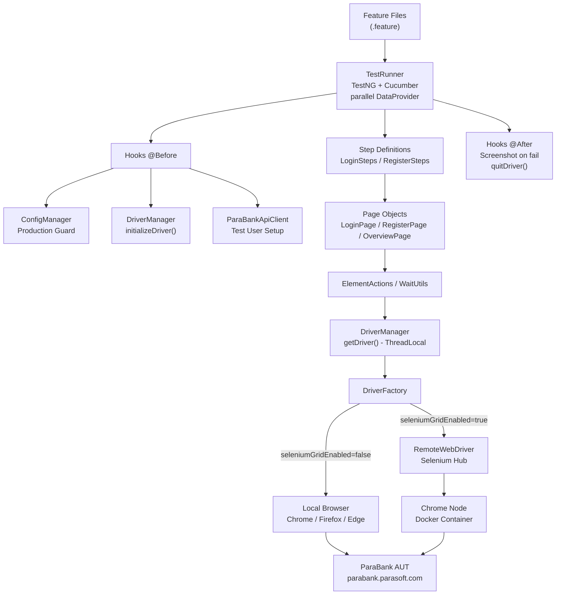
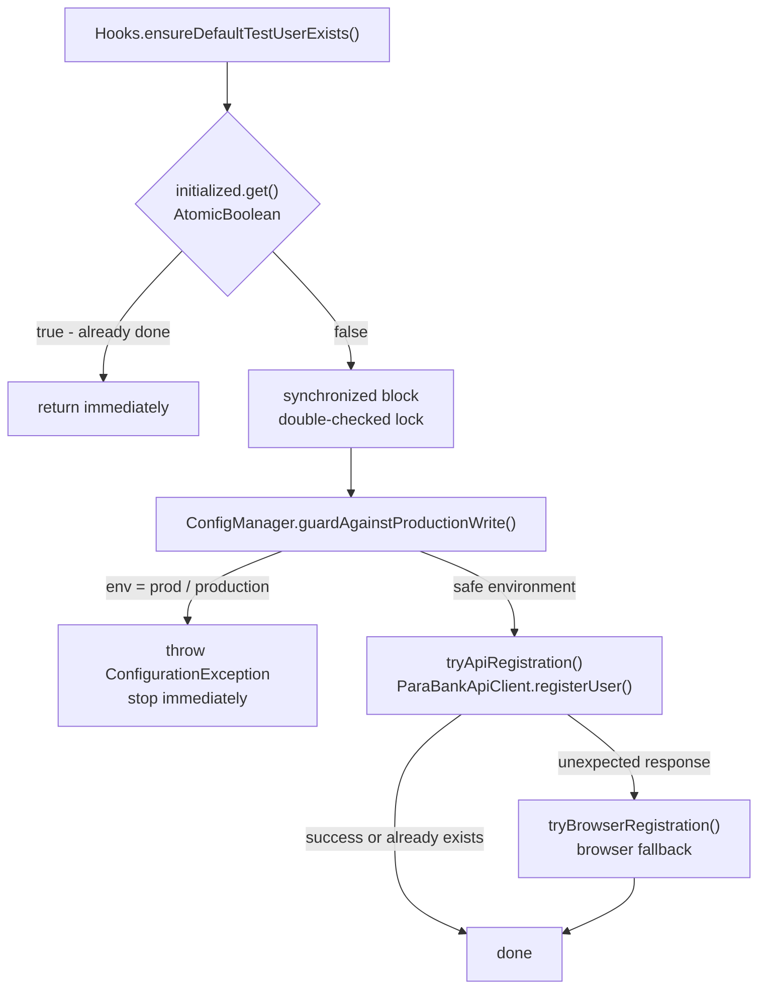
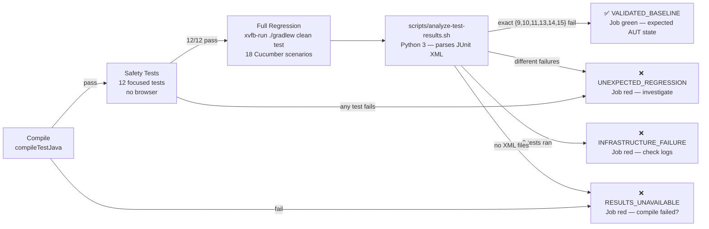

# Framework Architecture

**Framework:** ParaBank BDD Automation  
**Last Updated:** 2026-07-19

---

## Related Documents

| Document | Purpose |
|---|---|
| [PORTFOLIO_OVERVIEW.md](PORTFOLIO_OVERVIEW.md) | Recruiter and reviewer summary |
| [INTERVIEWER_GUIDE.md](INTERVIEWER_GUIDE.md) | Suggested technical review path |
| [TEST_STRATEGY.md](TEST_STRATEGY.md) | Test scope, tags, and known failure baseline |
| [FRAMEWORK_EXTENSION_GUIDE.md](FRAMEWORK_EXTENSION_GUIDE.md) | Layer rules, anti-patterns, extension workflow |
| [CI_CD_GUIDE.md](CI_CD_GUIDE.md) | CI pipeline stages and result classification |

---

## 1. Purpose

This document describes the internal architecture of the ParaBank BDD automation framework. It covers the layered design, execution flows, driver lifecycle, provisioning strategy, production safety mechanism, reporting pipeline, and CI classification logic. All diagrams reflect the actual implemented code.

---

## 2. System Context

```
┌─────────────────────────────────────────────────┐
│  Developer / CI Runner                          │
│                                                 │
│  ./gradlew clean test                           │
│         │                                       │
│         ▼                                       │
│  ParaBank BDD Framework                         │
│  (Java 17 · Cucumber · TestNG · Selenium)       │
│         │                                       │
│         ├── Local Chrome / Firefox / Edge       │
│         │                                       │
│         └── Selenium Grid (Docker)              │
│                   │                             │
└─────────────────────────────────────────────────┘
          │
          ▼
  ParaBank AUT (parabank.parasoft.com)
  Public demo banking application — shared, uncontrolled
```

The AUT is a public demonstration application. The framework does not own or control it. Six consistently failing scenarios document documented AUT behaviour, not framework defects.

---

## 3. Layered Architecture

```
┌─────────────────────────────────────────────────┐
│  Feature Files (.feature)                       │  ← Business readable
│  Gherkin scenarios, no locators, no Java        │
├─────────────────────────────────────────────────┤
│  Step Definitions                               │  ← Cucumber glue
│  Map Gherkin → Java; delegate to page objects   │
├─────────────────────────────────────────────────┤
│  Page Objects (extends BasePage)                │  ← UI abstraction
│  Private locators, fluent API, typed navigation │
├─────────────────────────────────────────────────┤
│  ElementActions / WaitUtils / JSUtils           │  ← Selenium wrappers
│  Single-responsibility; no Thread.sleep()       │
├─────────────────────────────────────────────────┤
│  DriverManager / DriverFactory                  │  ← Driver lifecycle
│  ThreadLocal WebDriver; local or RemoteWebDriver│
├─────────────────────────────────────────────────┤
│  Selenium WebDriver                             │
│  Local browser  ──or──  Selenium Grid           │
└─────────────────────────────────────────────────┘

Supporting concerns (horizontal):
  ConfigManager   — credential priority chain; production guard
  Hooks           — lifecycle: setup, teardown, provisioning
  ParaBankApiClient — API-assisted test user setup
  Reporting       — ExtentReports, Allure, Cucumber HTML, screenshots
```

**Layer contract:** Each layer only calls the layer immediately below it. Step definitions never call WebDriver directly. Page objects never contain assertions. Hooks use `ConfigManager` before any write path.

---

## 4. Main Execution Flow



---

## 5. Driver Lifecycle

Each test thread has an isolated browser instance:

```
@Before (per scenario, per thread)
  ├─ MDC.put("scenarioName", name)
  ├─ ensureDefaultTestUserExists()   ← once per JVM only (AtomicBoolean)
  └─ DriverManager.initializeDriver()
       └─ DriverFactory.createDriver()
            ├─ if seleniumGridEnabled → new RemoteWebDriver(hubUrl, options)
            └─ else → new ChromeDriver(options) / FirefoxDriver / EdgeDriver

Step execution
  └─ DriverManager.getDriver()  ← ThreadLocal lookup, never shared

@After (per scenario, per thread)
  ├─ if scenario failed → ScreenshotUtils.captureScreenshot()
  └─ DriverManager.quitDriver()
       └─ driver.quit() + ThreadLocal.remove()
```

**Thread safety:** `DriverManager` stores `WebDriver` in `ThreadLocal<WebDriver>`. Each parallel thread creates, uses, and destroys its own driver without sharing. SLF4J MDC stores `scenarioName` per thread for log traceability.

---

## 6. Local vs Remote Execution

| Property | Local | Selenium Grid |
|---|---|---|
| Controlled by | `seleniumGridEnabled=false` (default) | `seleniumGridEnabled=true` |
| Driver type | `ChromeDriver` / `FirefoxDriver` via WebDriverManager | `RemoteWebDriver` pointed at Hub URL |
| Browser location | Same machine as test code | Chrome Node Docker container |
| Driver download | WebDriverManager auto-downloads | Not needed — Grid provides browser |
| Session visibility | Not visible remotely | noVNC on port 7900 (`secret`) |
| Scale-out path | Limited by local resources | Add Chrome Node containers |

Code path is identical from page-object layer upward. `DriverFactory` selects the implementation; the rest of the framework is unaware of which mode is active.

---

## 7. Test-User Provisioning Flow

The `sqa` test user must exist before login scenarios run. The provisioning hook runs **once per JVM** regardless of how many scenarios execute:



Both write paths (API and browser fallback) are protected by the same guard at the orchestration level.

---

## 8. Production Write Protection

```java
// Hooks.java — ensureDefaultTestUserExists()
synchronized (LOCK) {
    if (DEFAULT_USER_SETUP_DONE.get()) return;
    ConfigManager.getInstance()
        .guardAgainstProductionWrite("default test user registration");
    //  ↑ throws ConfigurationException if env = "prod" or "production"
    tryApiRegistration(username, password);     // API path
    //  ↑ also protected by the same guard before entering the method
    DEFAULT_USER_SETUP_DONE.set(true);
}
```

**What the guard prevents:** Automatic test-user creation via `ParaBankApiClient` and via the browser fallback. Both paths funnel through the same orchestration method where the guard runs.

**What the guard does not restrict:** Read-only navigation, assertions, or any write triggered by an explicit scenario step against the AUT.

**Tested by:** `ProductionSafetyGuardTest` — 12 focused TestNG tests; no browser; no network. All `prod`/`production` (case-insensitive) aliases throw `ConfigurationException`. All other environments pass.

---

## 9. Page Object Design

Locators are private static final fields, never exposed outside the page class:

```java
public class LoginPage extends BasePage {
    private static final By USERNAME_FIELD = By.cssSelector("input[name='username']");
    private static final By PASSWORD_FIELD = By.cssSelector("input[name='password']");
    private static final By LOGIN_BUTTON   = By.cssSelector("input[value='Log In']");

    public LoginPage(WebDriver driver) { super(driver); }

    public LoginPage fillUsername(String username) {
        sendKeys(USERNAME_FIELD, username);
        return this;
    }

    public OverviewPage clickLoginButton() {
        click(LOGIN_BUTTON);
        return createPage(OverviewPage.class);   // typed navigation
    }
}
```

`BasePage.createPage(Class<T>)` uses reflection to instantiate the next page object. This gives step definitions compile-time type safety when navigating between pages without hard-coding driver references at the call site.

---

## 10. Explicit Wait Strategy

`WaitUtils` wraps `WebDriverWait`. `Thread.sleep()` is absent from the codebase:

```java
// Wait for element to be visible before reading text
WaitUtils.waitForElementToBeVisible(driver, locator);

// Wait for element to be clickable before clicking
WaitUtils.waitForElementToBeClickable(driver, locator);

// Wait for element to exist in DOM
WaitUtils.waitForElementToBePresent(driver, locator);
```

Timeout and poll interval come from `TimeoutConstants`, loaded from properties. The default page-load timeout is set per-driver in `DriverFactory.configureDriver()`.

---

## 11. CI Classification Flow



The classifier is the **only** mechanism that determines the final job result. A green CI badge means the run produced exactly the accepted known-failure set.

---

## 12. Reporting Flow

```
Test Execution
  │
  ├─ Cucumber JSON → ExtentCucumberAdapter → build/reports/extent/Report.html
  │    (interactive HTML: scenario timeline, pass/fail chart, screenshots)
  │
  ├─ Cucumber JSON → cucumber-html-plugin → build/reports/cucumber/cucumber-report.html
  │    (standard scenario/step breakdown)
  │
  ├─ TestNG XML → build/reports/tests/test/index.html
  │    (suite summary, timing, thread mapping)
  │
  ├─ allure-results/ → allure generate → allure-report/
  │    (trend graphs, flaky detection, step attachments)
  │
  └─ ScreenshotUtils → build/screenshots/<name>_<timestamp>.png
       └─ attached inline to ExtentReport + Cucumber HTML on failure
```

All four output formats are generated on every run, regardless of pass or fail. CI uploads all artifact directories with `if: always()`.

---

## 13. Key Design Decisions

| Decision | Rationale | Trade-off |
|---|---|---|
| Thin step definitions | BDD glue stays readable and delegates to page objects | Requires disciplined page-object design per extension |
| API-first test-user setup | Faster than browser registration; idempotent across reruns | Depends on public AUT registration endpoint remaining available |
| Browser fallback path | Maintains setup resilience when API endpoint is unavailable | Adds a second write path that must be guarded independently |
| Production write guard at orchestration | Single guard protects both API and browser write paths | Guard scope covers setup writes only, not scenario-step writes |
| Known failures kept active | AUT quality signal is preserved; no suppression | Raw Gradle task exits non-zero on every run |
| CI classifier | Distinguishes accepted AUT failures from unexpected regression | Expected failure set is hard-coded and must be updated if baseline changes |
| `ThreadLocal<WebDriver>` | Parallel test threads are fully isolated | Driver must be quit explicitly in `@After` or instances leak |
| `createPage()` factory | Compile-time type safety when navigating between pages | Requires pages to have a `(WebDriver)` constructor |
| Explicit waits only | Consistent, controllable wait behaviour | Requires explicit wait calls for every element interaction |
| Grid health-check cascade | Prevents test execution before node registers | Adds Docker health-check configuration; startup time is ~60s |

---

## 14. Package Responsibilities

| Package | Key Classes | Responsibility |
|---|---|---|
| `config` | `ConfigManager`, `ProductionSafetyGuardTest` | Environment loading, credential chain, production guard |
| `constants` | `BrowserConstants`, `TimeoutConstants`, `PathConstants`, `FrameworkConstants` | Compile-time literals; no magic strings scattered through code |
| `driver` | `DriverManager` | `ThreadLocal<WebDriver>` storage; init and quit lifecycle |
| `factory` | `DriverFactory` | Local browser or `RemoteWebDriver` instantiation |
| `hooks` | `Hooks` | Cucumber `@Before`/`@After`; MDC; test-user provisioning |
| `pages` | `BasePage`, `LoginPage`, `RegisterPage`, `OverviewPage`, + 5 more | UI abstraction; private locators; fluent API |
| `runner` | `TestRunner` | `@CucumberOptions`; TestNG integration; parallel DataProvider |
| `stepdefinitions` | `LoginSteps`, `RegisterSteps` | Gherkin-to-Java mapping; assertions in `@Then` only |
| `utils` | `ElementActions`, `WaitUtils`, `JSUtils`, `ScreenshotUtils`, `ExcelDataProvider`, `ParaBankApiClient` | Reusable cross-cutting utilities |

---

## 15. Extension Boundaries

Safe to extend (follows existing patterns):

- Add new page objects by extending `BasePage`
- Add new feature files + step definitions following the existing layer contract
- Add new environment properties files following the existing naming convention
- Add new focused framework tests following `ProductionSafetyGuardTest` patterns

Requires care (review `docs/FRAMEWORK_EXTENSION_GUIDE.md` first):

- Adding new write operations to hooks → must add production guard
- Adding new HTTP operations to `ParaBankApiClient` → review production implications
- Changing tag expressions → update `EXPECTED_CUCUMBER` in `scripts/analyze-test-results.sh`
- Changing execution count → update classifier expected count

See [docs/FRAMEWORK_EXTENSION_GUIDE.md](FRAMEWORK_EXTENSION_GUIDE.md) for the full extension workflow, anti-patterns, and validation checklist.
